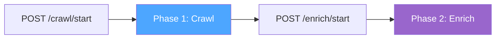
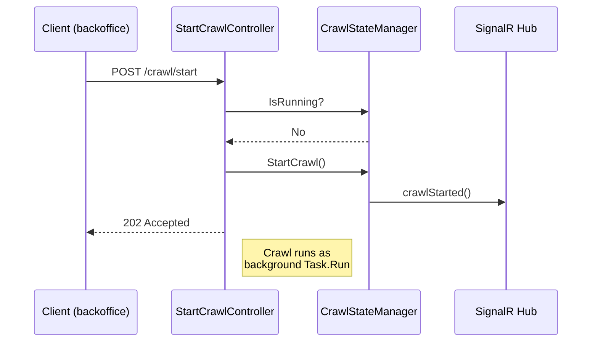
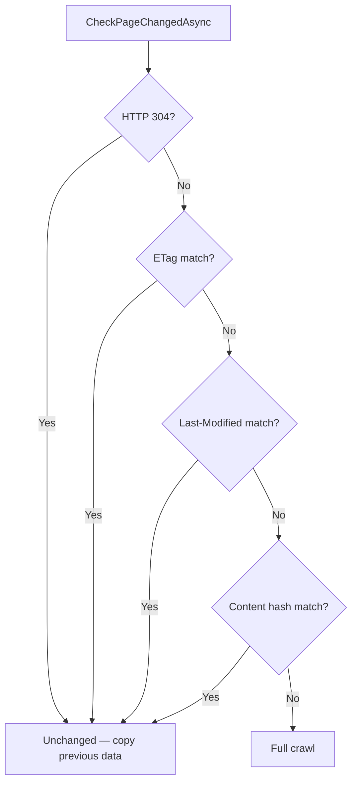
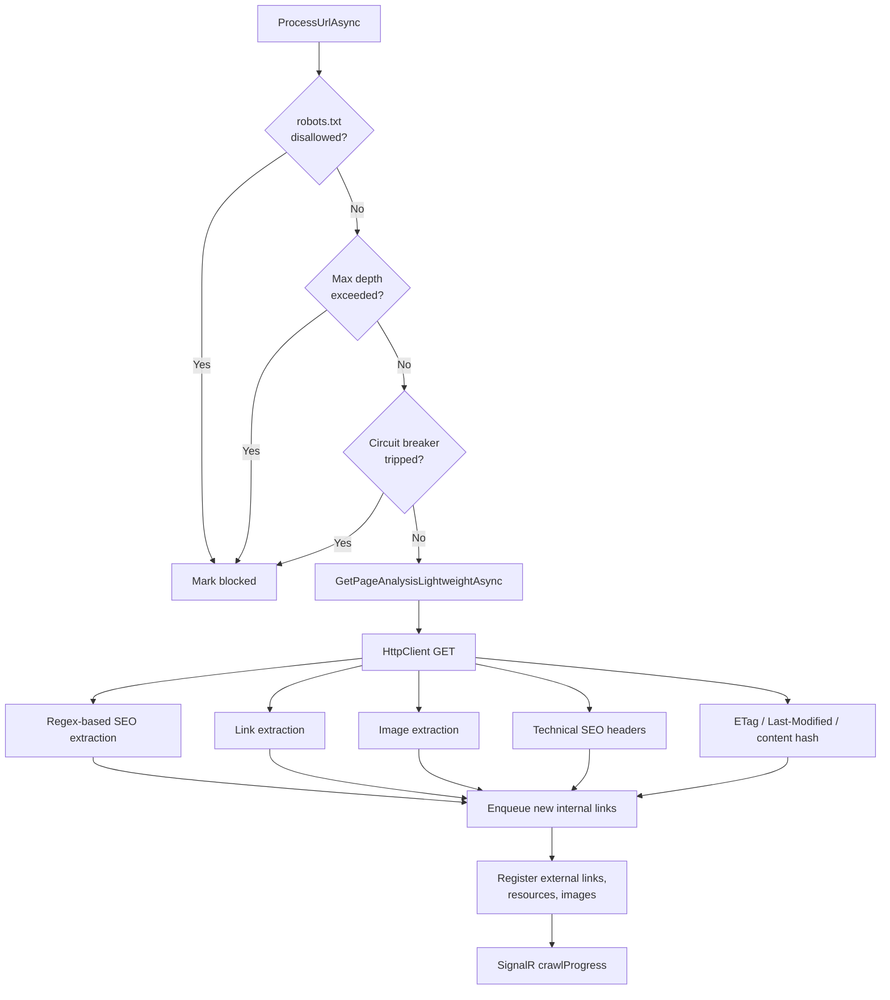
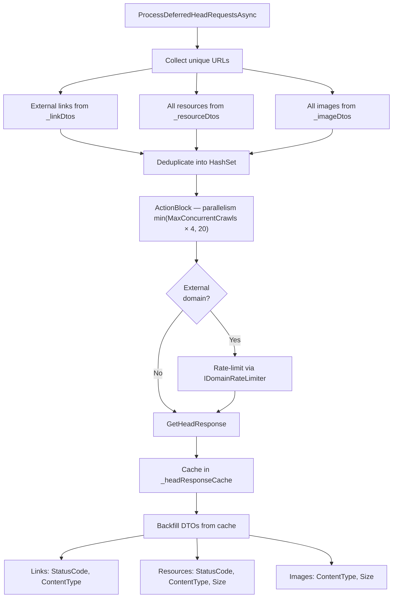
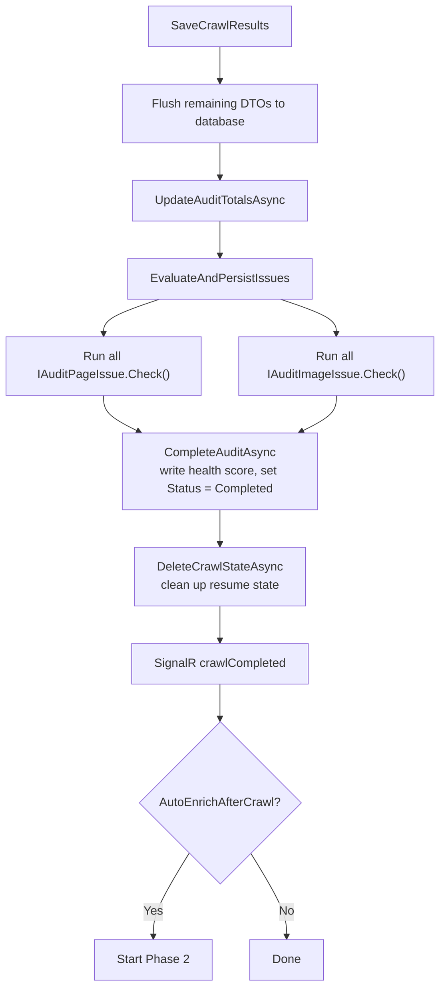
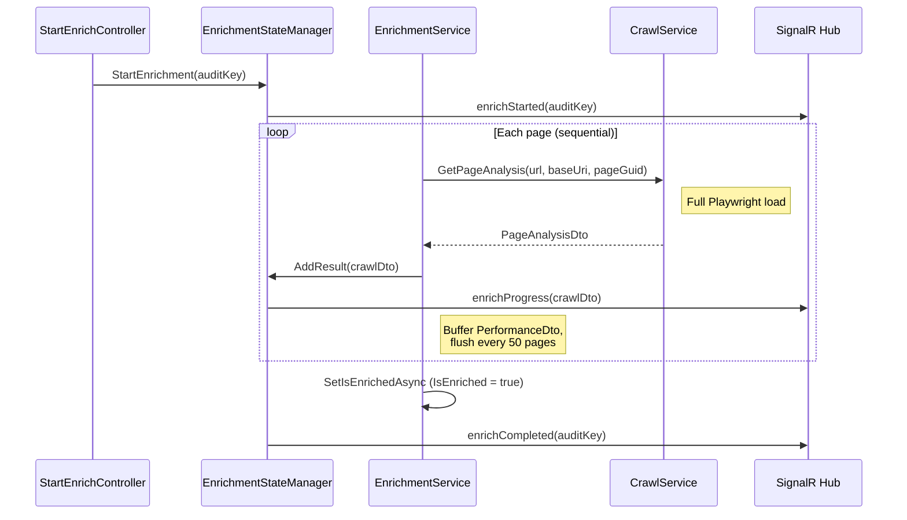
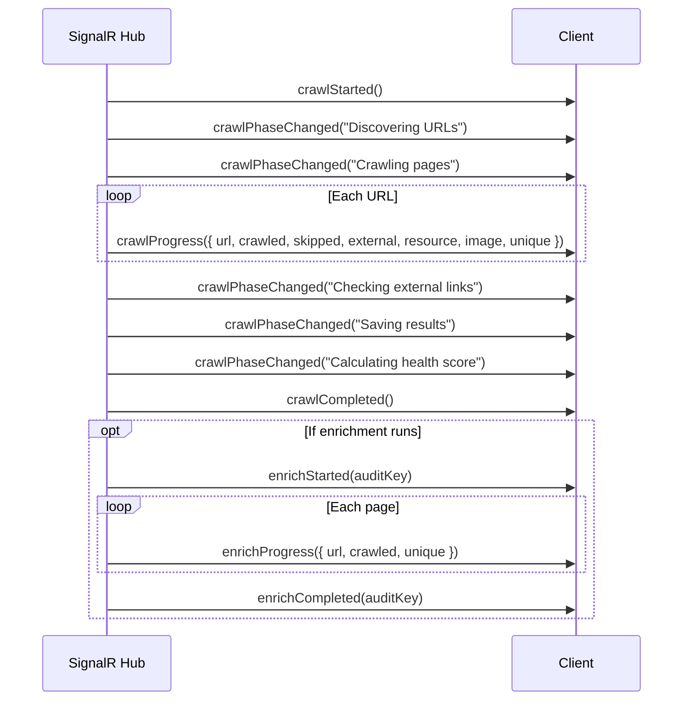

# Crawl Data Flow

This document describes what happens internally when a crawl is started, from the initial HTTP request through to the completed audit record in the database.

## Overview

A crawl runs in two phases:

1. **Phase 1 — Crawl** (`POST /crawl/start`): discovers and analyses every URL on the site using **HttpClient only**. Fast and low-resource — collects SEO, links, images, technical headers, and fingerprint data, but not Core Web Vitals.
2. **Phase 2 — Enrich** (`POST /enrich/start`): re-visits each page with **Playwright** to collect Core Web Vitals and full performance metrics. Can be triggered manually from the backoffice or automatically after Phase 1 via `AutoEnrichAfterCrawl`.

---

## Phase 1: Crawl

### 1. Request arrives

`StartCrawlController` checks that no crawl is already running via `ICrawlStateManager.IsRunning`. If clear, it calls `CrawlStateManager.StartCrawl()` which:
- resets internal state (results list, cancellation token)
- broadcasts `crawlStarted()` to all connected SignalR clients

The actual crawl is spawned as a background `Task.Run` using a new DI scope, then the controller immediately returns `202 Accepted`.

---

### 2. URL discovery

`AuditService.StartCrawl()` resolves the base URL (from config `BaseUrl` or the incoming request host), then runs all registered `IUrlDiscoveryStrategy` implementations in parallel:

| Strategy | Enabled by |
|---|---|
| `SitemapUrlDiscoveryStrategy` | `UseSitemapXml: true` (default) |
| `UmbracoContentUrlDiscoveryStrategy` | `UseUmbracoContentIndex: true` |

Each strategy yields a set of URLs which are enqueued. The starting URL (`/`) is always added. Discovered URLs are also matched against Umbraco content nodes so that a `nodeKey` (GUID) can be associated with each page.

If `RespectRobotsTxt` is enabled, `IRobotsService` fetches and parses `robots.txt`. Disallowed paths are stored and checked per URL. The `Crawl-delay` directive, if present, overrides `CrawlDelayMs` from config.

---

### 3. Incremental crawl check

When `UseIncrementalCrawl` is enabled, `ICrawlResultPersistence.GetPageFingerprintsAsync()` loads all page fingerprints from the previous audit (ETag, Last-Modified, content SHA-256 hash). For each URL dequeued:

Pages skipped by incremental crawl are reported to the SignalR hub with `Skipped = true`.

---

### 4. Parallel page processing

**Internal pages** are processed by a TPL Dataflow `ActionBlock<UrlQueueItem>` with degree of parallelism set to `MaxConcurrentCrawls` (default: 4, range 1–20).

External links, resource URLs (CSS, JS, fonts), and image URLs never enter the queue or ActionBlock. When discovered during a page crawl they are registered directly into `_crawlResults` and pushed to SignalR via `RegisterCrawlResult`, keeping ActionBlock slots free for pages that need HTTP requests. Each URL is classified as either a resource or an image (never both) — URLs that appear in both the resource list and the image list are classified as images. No HEAD requests are made during this phase — external/resource/image URLs are collected for deferred processing in step 5.

For each internal page, `ProcessUrlAsync` runs:

Crawl state (visited URLs, pending queue, disallowed paths) is saved to `umbContentAuditCrawlState` every 50 pages so a crashed or timed-out crawl can be resumed.

---

### 5. Deferred HEAD requests

Once all internal pages have been processed, the crawl enters a second sub-phase to check external links, resources, and images. This is handled by `ProcessDeferredHeadRequestsAsync`.

**Why deferred?** During step 4, external HEAD requests would block internal URL discovery — a page with 30 external links would stall the crawl frontier while waiting on slow domains. Deferring means: (a) the internal link graph completes as fast as the site can respond, (b) duplicate external URLs across pages are naturally deduplicated (one HEAD per unique URL), and (c) rate limiting is simpler since internal crawl and external checks don't compete for connections.

If the crawl times out or is cancelled during step 4, this phase is skipped. External link status codes will be missing but all URLs are still recorded.

---

### 6. Data collected per page

| Category | Key fields | Notes |
|---|---|---|
| Page | URL, status code, redirect URL, unique GUID | |
| SEO | Title, meta description, canonical, H1, noindex, nofollow, Open Graph | |
| Technical SEO | Content-Type, gzip, browser caching, HTTPS | |
| Links | URL, source page, internal/external flag, status code | External status codes populated in step 5 |
| Images | URL, source page, alt text, title, internal/external flag | Content-type and size populated in step 5 |
| Fingerprint | ETag, Last-Modified, content SHA-256 | For next incremental crawl |
| Performance | Page load time, CLS, FCP, LCP, TTI, TTFB, total bytes | **Phase 2 only** |

---

### 7. Completion

Once the URL queue is empty, all workers have finished, and deferred HEAD requests are complete:

---

## Phase 2: Enrich

Triggered manually via `POST /enrich/start?auditKey={guid}` (omit `auditKey` to target the latest audit), or automatically after Phase 1 when `AutoEnrichAfterCrawl: true`.

---

## Database tables written

| Table | Phase | Content |
|---|---|---|
| `umbContentAuditOverview` | 1 | Audit summary, health score, status, `IsEnriched` flag |
| `umbContentAuditInternalPages` | 1 | One row per URL (status code, redirect, unique GUID) |
| `umbContentAuditSeo` | 1 | SEO metrics per page |
| `umbContentAuditTechnicalSeo` | 1 | Gzip, caching, HTTPS per page |
| `umbContentAuditLink` | 1 | All links found (internal and external) |
| `umbContentAuditImage` | 1 | All images found |
| `umbContentAuditPerformance` | 2 | Core Web Vitals; written by Phase 2, replaced on re-enrich |
| `umbContentAuditCrawlState` | 1 (temp) | Resume state; deleted on successful completion |
| `umbContentAuditPageFingerprint` | 1 | ETag / hash per URL for next incremental crawl |

---

## SignalR events timeline

Clients that connect mid-crawl receive the full current state (all previous `crawlProgress` / `enrichProgress` events) replayed on connect via `ContentAuditHub.OnConnectedAsync`.
